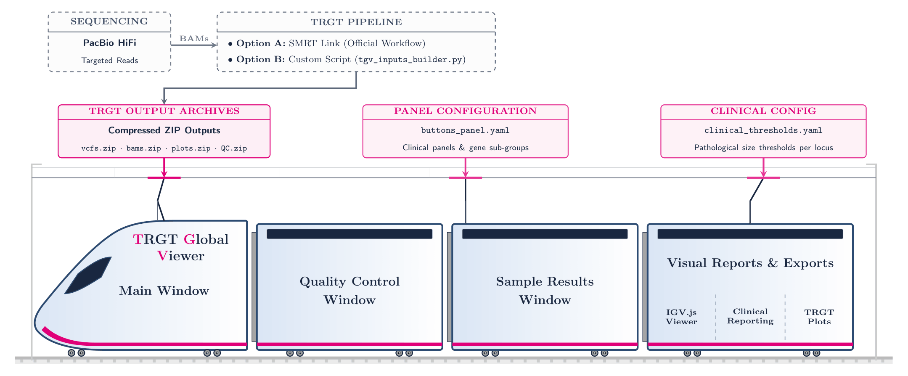

# TGV — TRGT Global Viewer



<details open>
  <summary><b>🇫🇷 Version Française (Cliquez pour replier)</b></summary>
  <br>

**TGV (TRGT Global Viewer)** est un outil de visualisation clinique conçu pour le CHU de Nîmes. Il simplifie l'analyse, le contrôle qualité et l'interprétation des répétitions en tandem issues du workflow **TRGT (PacBio SMRT Link)**.

---

### 🧬 Contexte Clinique & Vision "Zéro Désarchivage"

* **Le défi diagnostique** : L'analyse des expansions de répétitions en tandem (ex: ataxies) repose sur le séquençage HiFi de haute précision à longues lectures (séquenceur **PacBio Vega**). Si l'outil TRGT offre un profilage génomique puissant, les données brutes générées sont denses, éparpillées et complexes à manipuler.
* **La vision "Zéro désarchivage manuel" (Ergonomie)** : Au quotidien, manipuler et décompresser manuellement des dizaines d'archives ZIP volumineuses (fichiers BAM de plusieurs centaines de mégaoctets, graphiques d'allèles ou de méthylation) est une tâche lourde. **TGV résout ce problème en lisant et en traitant toutes les données directement à la volée en arrière-plan, sans aucune décompression manuelle préalable sur le disque dur de l'utilisateur.**

---

### 📋 Caractéristiques principales

* **Interface graphique (GUI) intuitive** :  Chargement des données, filtrage par patient ou locus (TRID), et édition dynamique des seuils cliniques ou génotypes.
* **Cochage automatique par panel** : Intègre un système de boutons configurables permettant de sélectionner automatiquement en un clic des listes de gènes d'intérêt (panels in silico) définies par l'utilisateur.
* **Visualisation d'alignements (igv.js)** :  Extraction automatique des bams (spanning_BAM / repeat_reads) et ouverture d'une session IGV locale dans votre navigateur pour une inspection immédiate.
* **Affichage de graphiques TRGT (SVG)** : Rendu direct des profils d'allèles et de méthylation générés par l'outil TRVZ (TRGT), sans extraction manuelle.
* **Rapport de contrôle qualité global (QC)** : Rapport HTML généré à la volée pour visualiser la qualité d'enrichissement du run. Note : QC produit via le module tgv_inputs_builder.py.
* **Traçabilité par fichier de logs** : Chaque analyse génère un journal structuré et horodaté dans logs/ (versions, entrées, étapes du pipeline et alertes).
* **Zéro empreinte disque** : Création de fichiers temporaires uniquement. Un nettoyage automatique est garanti à la fermeture de l'application.
* **Léger et portable** : Développé sans dépendances lourdes (pas de Pandas, NumPy ou Jinja2). Disponible en exécutable autonome (Windows) ou script léger (Linux/macOS).

---

### 🚀 Comment l'utiliser (Usage)

L'outil **TGV** s'adapte à votre environnement via deux modes d'exécution :

#### Option A : Sous Windows (Exécutable autonome)
Destiné aux cliniciens et biologistes sur poste de travail Windows.
1. Téléchargez l'exécutable autonome **`TGV.exe`** depuis l'onglet *Releases* de ce dépôt GitHub.
2. Double-cliquez sur l'exécutable pour lancer l'application. 
*Aucune installation de Python ou de bibliothèque n'est requise.*

#### Option B : Sous Linux / macOS (Ligne de commande)
Destiné aux bio-informaticiens ou pour une utilisation sur serveur de calcul.

1. Installez les deux dépendances requises :
   ```bash
   pip install PySimpleGUI-4-foss pyyaml
   ```
2. Lancez l'application :
   ```bash
   python main.py
   ```

---

### 📂 Spécifications des Entrées (Inputs)

Pour fonctionner de manière transparente et sans désarchivage préalable, **TGV** s'appuie sur une structure d'archives standardisée **au niveau du Run** (les fichiers d'échantillons individuels sont stockés à l'intérieur d'archives globales du run) :

#### 1. Fichiers généraux de l'analyse (Sélection manuelle sur l'IHM)
* **Archive de VCFs TRGT (`{ID_RUN}-trgt_vcfs.zip`)** : L'archive ZIP contenant l'ensemble des fichiers `.trgt.vcf` du run (un fichier VCF par échantillon).
* **Génome de référence (Optionnel)** : Le fichier de référence génomique au format `.fa` ou `.fasta` accompagné de son fichier d'index `.fai` (ex : `hg38.fa` et `hg38.fa.fai`).

#### 2. Archives globales de Run détectées automatiquement (Sister ZIPs)
TGV détecte automatiquement les archives associées présentes dans le même répertoire, sous réserve qu'elles partagent exactement le même préfixe de run (`{ID_RUN}-`) :
* **Alignements (BAM)** :
  * `{ID_RUN}-spanning_BAM.zip` : Contient les fichiers BAM/BAI de type *spanning* pour tous les patients du run.
  * `{ID_RUN}-repeat_reads.zip` : Contient les fichiers BAM/BAI de type *mapped* pour tous les patients du run.
* **Graphiques TRGT (SVG)** :
  * `{ID_RUN}-trgt_motifs_allele.zip` : Archives des profils de tailles des motifs d'allèles de tous les patients.
  * `{ID_RUN}-trgt_motifs_waterfall.zip` : Archives des profils de reads *waterfall* de tous les patients.
  * `{ID_RUN}-trgt_meth_allele.zip` : Archives de méthylation allèle-spécifique de tous les patients.
  * `{ID_RUN}-trgt_meth_waterfall.zip` : Archives de profils de reads *waterfall* de méthylation de tous les patients.

*Fonctionnement interne : Lors de la sélection d'un patient et d'un locus, TGV ouvre l'archive globale du run correspondante en mémoire, y recherche le fichier spécifique du patient (par exemple `nom_patient.sorted.spanning.bam`), l'extrait de manière temporaire pour l'analyse, puis nettoie le disque à la fermeture.*

#### 3. Rapport de Contrôle Qualité (Module exclusif TGV)
Ce rapport, qui n'est pas généré nativement par SMRT Link/TRGT, est **produit spécifiquement par votre script tgv_inputs_builder.py** à partir des données brutes du run. Il permet une supervision globale que le workflow standard ne propose pas.
L'archive **{id}-QC.zip** (générée par le builder) contient :
* **Rapport d'enrichissement** : target_enrichment_puretarget.report.json
* **Synthèse échantillons** : sample_summary.csv
* **Couverture par cible** : target_cov_by_sample.csv
* **Visualisations** : Graphiques PNG (ex: sample_coverage_boxplot-0.png, read_categories.png).

---

### ⚙️ Configuration & Personnalisation

TGV est hautement configurable pour s'adapter aux besoins spécifiques de votre laboratoire de diagnostic grâce à deux fichiers de configuration au format YAML situés dans le répertoire **`configs/`** :

* **`clinical_thresholds.yaml`** (`configs/`) : Fichier de référence clinique. Il définit, pour chaque maladie/locus (TRID), les plages de tailles de répétitions permettant de classer les allèles (Sain, Prémutation, Pathogène) ainsi que l'orientation du brin (Directe ou Reverse-Complement).
* **`buttons_panel.yaml`** (`configs/`) : Permet de personnaliser dynamiquement les boutons de l'interface graphique. Vous pouvez y définir des panels (ex: "Ataxies", "Myopathies") et lister les TRIDs associés pour les cocher automatiquement d'un seul clic à l'écran.

---

### 🛠️ Organisation des fichiers de logs

Pour assurer une traçabilité complète de vos analyses, **TGV** génère automatiquement des journaux horodatés dans le sous-dossier `logs/` :

*   **Pour l'analyse clinique (TGV GUI/CLI)** :
    `TGV_run_ANNEEMOISJOUR_HEUREMINUTESECONDE.log` (ex: `TGV_run_20260612_145002.log`)
*   **Pour la préparation des données (Builder)** :
    `tgv_input_builder.ANNEEMOISJOUR_HEUREMINUTESECONDE.log` (ex: `tgv_input_builder.20260922135222.log`)

Ces fichiers permettent un audit précis des versions utilisées, des fichiers sources et des éventuels avertissements rencontrés durant le traitement.

</details>

<br>

<details>
  <summary><b>🇬🇧 English Version</b></summary>
  <br>

**TGV (TRGT Global Viewer)** is a clinical visualization tool designed for Nîmes University Hospital. It streamlines analysis, quality control, and interpretation of tandem repeats from the **TRGT (PacBio SMRT Link)** workflow.

---

### 🧬 Clinical Context & "Zero Extraction" Philosophy

* **The diagnostic challenge**: Interpreting expansions of tandem repeats relies on high-precision HiFi sequencing (**PacBio Vega** sequencer). While TRGT provides powerful genomic profiling, raw outputs are dense and complex to handle.
* **The "Zero manual extraction" philosophy (Ergonomics)**: Handling dozens of heavy ZIP archives daily (BAM files, allele plots, methylation data) is tedious. **TGV processes all data on-the-fly in the background, eliminating the need for manual unarchiving on your local drive.**

---

### 📋 Main Features

* **Intuitive GUI**: Easily load data, filter patients or loci (TRIDs), and adjust clinical thresholds or genotypes.
* **Automation Modules**: 
    * **`tgv_inputs_builder.py`**: Automates archive structuring and QC report generation.
    * **`tgv_cli.py`**: Command-line interface for batch processing and pipeline integration.
* **Alignment Visualization (igv.js)**: Automated BAM extraction with an embedded HTTP server (Range Requests) for smooth inspection.
* **TRGT Graphics Display (SVG)**: Direct rendering of allele/methylation plots (TRVZ tool) with no manual extraction.
* **Global Run QC**: On-the-fly HTML quality report (generated via `tgv_inputs_builder.py`).
* **Traceability & Logs**: Structured, timestamped logs for both the GUI and the Builder in `logs/`.
* **Zero Disk Footprint**: Automated cleanup of temporary files upon exit.
* **Lightweight & Portable**: No heavy dependencies (no Pandas/NumPy). Portable executable (Windows) or simple script (Linux/macOS).

---

### 🚀 How to use (Usage)

**TGV** adapts to your work environment through two execution modes:

#### Option A: Windows (Standalone executable)
Aimed at clinicians and biologists on Windows workstations.
1. Download the standalone **`TGV.exe`** from the *Releases* tab.
2. Double-click to launch.

#### Option B: Linux / macOS (Command-line usage)
Aimed at bioinformaticians or server environment usage.
1. Install dependencies: `pip install PySimpleGUI-4-foss pyyaml`
2. GUI Mode: `python main.py` | CLI Mode: `python tgv_cli.py --help`

---

### 📂 Input Specifications

**TGV** relies on standardized Run-level ZIP archives:
* **Manual Inputs (GUI)**: TRGT VCF archive (`{ID_RUN}-trgt_vcfs.zip`) and optional Reference Genome.
* **Auto-detected Sister ZIPs**: Alignment files (`spanning_BAM`, `repeat_reads`) and TRGT plot archives (`motifs_allele`, `motifs_waterfall`, `meth_allele`, `meth_waterfall`).
* **QC Report (Exclusive TGV Module)**: Archive `{id}-QC.zip` (produced by `tgv_inputs_builder.py`) containing enrichment reports, summaries, and coverage plots.

---

### ⚙️ Configuration & Customization

* **`clinical_thresholds.yaml`**: Defines clinical size ranges and motif strand orientation.
* **`buttons_panel.yaml`**: Allows customizing the GUI with dynamic buttons for specific gene panels (e.g., "Ataxias").

---

### 🛠️ Logs Directory Organization

For full auditability, **TGV** generates timestamped logs in the `logs/` subdirectory:
*   **Clinical Analysis (GUI/CLI)**: `TGV_run_YYYYMMDD_HHMMSS.log`
*   **Data Preparation (Builder)**: `tgv_input_builder.YYYYMMDD_HHMMSS.log`

</details>

<br>

<details>
  <summary><b>📚 Références & Outils tiers / References & Third-Party Tools</b></summary>
  <br>

#### 🇫🇷 Références & Outils tiers
Si vous utilisez **TGV** dans le cadre de vos travaux cliniques ou de recherche, veuillez citer les outils sous-jacents :

* **TRGT / TRVZ** :
  > Dolzhenko, E., English, A., Dashnow, H., *et al.* Characterization and visualization of tandem repeats at genome scale. *Nat Biotechnol* (2024). [https://doi.org/10.1038/s41587-023-02057-3](https://doi.org/10.1038/s41587-023-02057-3)
* **igv.js** :
  > Robinson, J. T., Thorvaldsdóttir, H., Turner, D., & Mesirov, J. P. igv.js: an embeddable JavaScript implementation of the Integrative Genomics Viewer (IGV). *Bioinformatics*, 39(1), btac830 (2023). [https://doi.org/10.1093/bioinformatics/btac830](https://doi.org/10.1093/bioinformatics/btac830)

---

#### 🇬🇧 References & Third-Party Tools
If you use **TGV** for clinical work or scientific publications, please acknowledge the underlying tools:

* **TRGT / TRVZ**:
  > Dolzhenko, E., English, A., Dashnow, H., *et al.* Characterization and visualization of tandem repeats at genome scale. *Nat Biotechnol* (2024). [https://doi.org/10.1038/s41587-023-02057-3](https://doi.org/10.1038/s41587-023-02057-3)
* **igv.js**:
  > Robinson, J. T., Thorvaldsdóttir, H., Turner, D., & Mesirov, J. P. igv.js: an embeddable JavaScript implementation of the Integrative Genomics Viewer (IGV). *Bioinformatics*, 39(1), btac830 (2023). [https://doi.org/10.1093/bioinformatics/btac830](https://doi.org/10.1093/bioinformatics/btac830)

</details>

<br>

<details>
  <summary><b>📝 Licence & Auteurs / License & Authors</b></summary>
  <br>

* **Auteur principal / Main Author** : Corentin Marco (CHU de Nîmes)
* **Licence / License** : Ce projet est sous licence libre **Creative Commons Attribution - Pas d'Utilisation Commerciale 4.0 International** (CC BY-NC 4.0).

Pour plus de détails, veuillez vous référer aux termes de la licence Creative Commons en ligne. / For more details, please refer to the Creative Commons license terms online.

</details>
